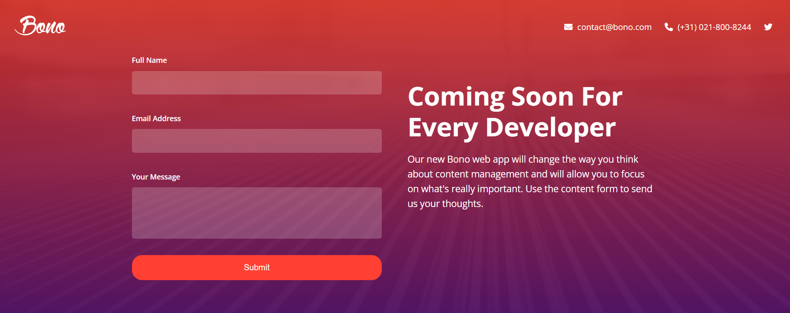

   
    
   

  

    
    
  

  <h3 align="center">Bono | Form Landing Page</h3>

   

     This is a landing page that contains a form, that allows users to join an email list for a new app that is being developed called Bono.
    

